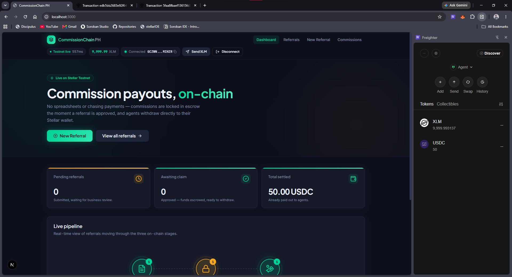
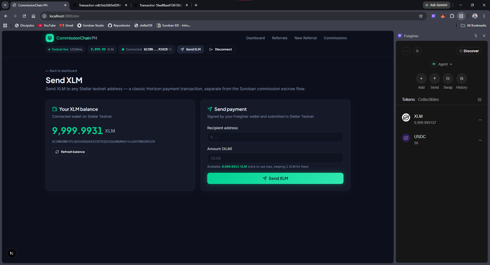
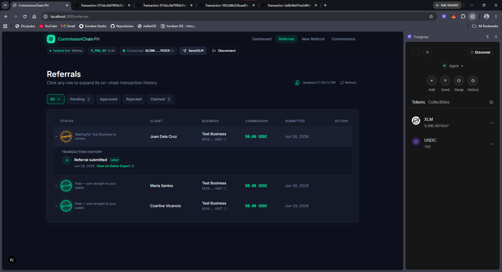
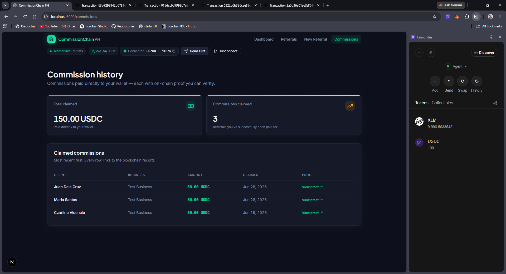
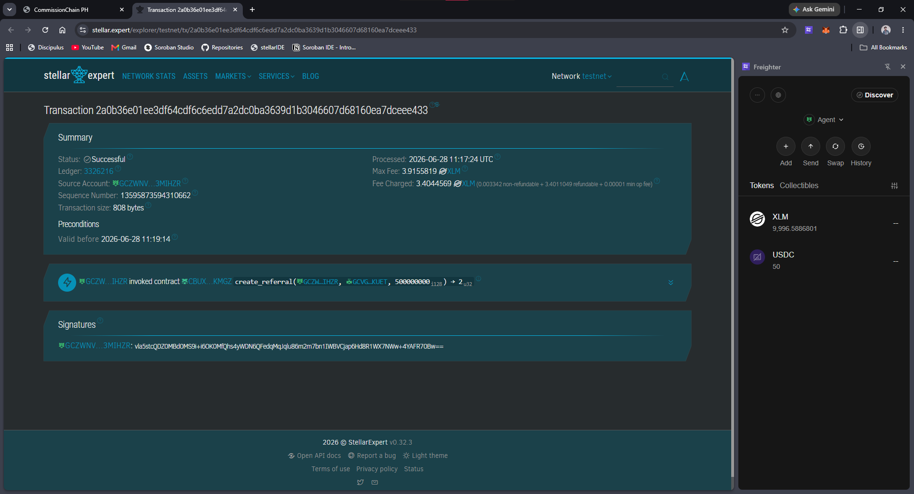
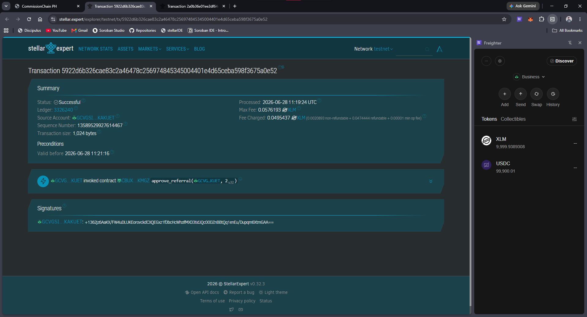
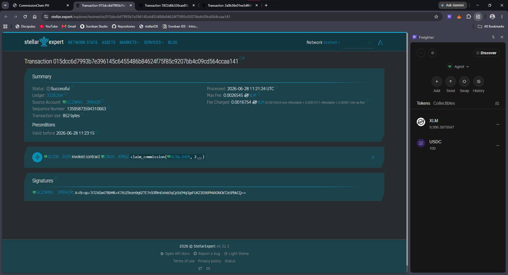
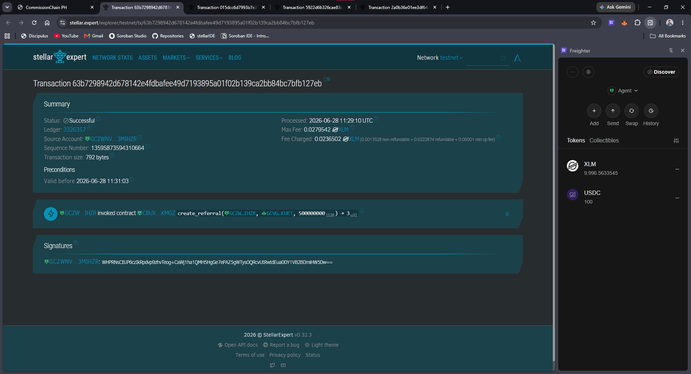
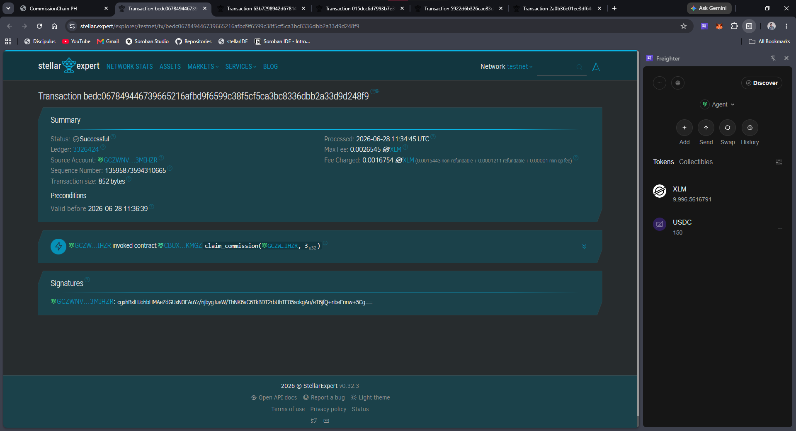

# CommissionChain PH

On-chain referral commission escrow for Philippine SME businesses and
freelance sales agents, built on Stellar and Soroban.

> **Status:** hackathon/testnet prototype. The smart contract is
> functionally tested (see [Testing](#testing) below) but has **not** been
> professionally audited, and must not be pointed at mainnet funds without
> one first.

## The problem

Insurance agencies, real-estate brokerages, recruitment firms, solar
installers, and marketing agencies across the Philippines run on
freelance referral agents — people paid a commission whenever a referral
they bring in closes. Today that commission is tracked in a spreadsheet
or a notebook, approved informally, and paid out whenever the business
gets around to it. The agent has no record they can point to, no
visibility into approval status, and no way to know a payout is actually
coming until it shows up.

## The solution

CommissionChain PH puts the whole referral-to-payout lifecycle on Stellar:

1. An **agent** connects their Freighter wallet and submits a referral —
   client name, business, commission amount.
2. The **business** reviews it and either **approves** it (which escrows
   the commission on-chain immediately, transferred from the business's
   own balance into the contract) or **rejects** it.
3. Once approved, the **agent claims** the commission, releasing the
   escrowed funds straight to their wallet.

Every step is a real Soroban transaction signed by whichever party is
acting — the app never holds funds or private keys for anyone.

See [`docs/ARCHITECTURE.md`](docs/ARCHITECTURE.md) for the full system
diagram and a step-by-step breakdown of each transaction,
[`docs/WALKTHROUGH.md`](docs/WALKTHROUGH.md) for a complete, copy-pasteable
setup-to-demo walkthrough, [`docs/DEPLOYMENT.md`](docs/DEPLOYMENT.md) for
running the app locally and deploying it to Vercel, and
[`docs/PITCH.md`](docs/PITCH.md) / [`docs/HACKATHON.md`](docs/HACKATHON.md)
for the pitch materials and Stellar-fit rationale.

## Architecture at a glance

```
Agent / Business (Freighter)
        │  sign transactions
        ▼
Next.js 15 frontend  ──fetch──▶  Next.js API routes  ──build/submit──▶  Soroban RPC (testnet)
        │                              │                                       │
        │                              ▼                                      ▼
        │                        Supabase (Postgres)         Referral contract ──▶ USDC SAC
        ▼
   Dashboard / Referrals / New Referral / Commissions
```

- **`contracts/referral`** — the Soroban smart contract (Rust): the
  on-chain source of truth for a referral's state and the escrowed funds.
- **`web`** — the Next.js 15 + TypeScript app: frontend pages, the wallet
  integration, and the API routes that build/submit Soroban transactions
  and keep Supabase in sync with on-chain results.

## Tech stack

| Layer | Technology |
|---|---|
| Frontend | Next.js 15 (App Router), TypeScript, Tailwind CSS |
| Wallet | Freighter (`@stellar/freighter-api`) |
| Backend | Next.js API routes, `@stellar/stellar-sdk` |
| Blockchain | Stellar Testnet, Soroban smart contracts |
| Database | PostgreSQL via Supabase (`@supabase/supabase-js`, no ORM) |
| Smart contract | Rust + `soroban-sdk` |

## Repository layout

```
commissionchain-ph/
├── contracts/referral/      Soroban contract (Rust)
│   ├── src/lib.rs           Contract logic
│   ├── src/test.rs          5 required tests
│   └── Cargo.toml
├── web/                     Next.js application
│   ├── supabase/schema.sql  Database schema (run once in Supabase's SQL editor)
│   └── src/
│       ├── app/             Pages + API routes
│       ├── components/      UI components
│       └── lib/              Wallet, Stellar RPC, Supabase, formatting
├── docs/
│   ├── ARCHITECTURE.md      Diagram + transaction flow
│   ├── WALKTHROUGH.md       Full setup-to-demo walkthrough
│   ├── DEPLOYMENT.md        Run locally + deploy to Vercel
│   ├── PITCH.md             Elevator pitch, demo script, judge Q&A
│   └── HACKATHON.md         Why this fits Stellar
└── README.md
```

## Prerequisites

- Node.js 20+ and npm
- A Rust toolchain (1.84+) with the `wasm32v1-none` target (`rustup
  target add wasm32v1-none`) and the [Soroban / Stellar
  CLI](https://developers.stellar.org/docs/build/smart-contracts/getting-started/setup)
  for deploying the contract
- PostgreSQL via [Supabase](https://supabase.com) (a free project — no
  local Postgres install needed)
- The [Freighter](https://www.freighter.app/) browser extension, set to
  Testnet

## Setup

### 1. Install dependencies

```bash
cd web
npm install
```

### 2. Configure environment variables

```bash
cp .env.example .env
```

Create a free [Supabase](https://supabase.com) project, then run
`web/supabase/schema.sql` once in its SQL Editor (Supabase dashboard ->
SQL Editor -> New query -> paste -> Run) to create the tables this app
needs. Get your project's URL and secret key from Settings -> API Keys
and put them in `.env` as `SUPABASE_URL` / `SUPABASE_SECRET_KEY`. The
Stellar testnet values in `.env.example` already work as-is; you'll fill
in `NEXT_PUBLIC_REFERRAL_CONTRACT_ID` after deploying the contract in
step 3.

### 3. Build and deploy the smart contract

```bash
cd contracts/referral
rustup target add wasm32v1-none   # one-time; needs Rust 1.84+ (rustup update if older)
cargo test                         # run the 5 required tests
stellar contract build             # builds + optimizes target/wasm32v1-none/release/referral_contract.wasm

stellar contract deploy \
  --wasm target/wasm32v1-none/release/referral_contract.wasm \
  --source-account <your-funded-testnet-identity> \
  --network testnet
```

Note the contract id printed by `deploy` and put it in
`NEXT_PUBLIC_REFERRAL_CONTRACT_ID` in `web/.env`.

Then initialize it once, pointing it at the token it should escrow
commissions in (testnet USDC, or your own test asset's Stellar Asset
Contract wrapper):

```bash
stellar contract invoke \
  --id <your-contract-id> \
  --source-account <your-admin-identity> \
  --network testnet \
  -- initialize --admin <your-admin-public-key> --token <usdc-sac-contract-id>
```

Put that same token contract id in `NEXT_PUBLIC_COMMISSION_TOKEN_ID`.

**For the full version of this — including how to get a test USDC token
onto testnet and set up Freighter for a live demo — see
[`docs/WALKTHROUGH.md`](docs/WALKTHROUGH.md).**

### 4. (Optional) Generate official shadcn/ui components

The project ships with small, hand-written UI primitives in
`src/components/ui/` so it runs immediately with zero extra setup. A
`components.json` is already in place if you'd rather swap in the
official shadcn components:

```bash
npx shadcn@latest add button card badge input label
```

### 5. Run it

```bash
npm run dev
```

Open two browser profiles (or two browsers) with Freighter installed —
one funded testnet account acting as the agent, another as the business
— and walk through the flow in [`docs/PITCH.md`](docs/PITCH.md)'s demo
script. Use [Friendbot](https://friendbot.stellar.org/) to fund each
testnet account, and make sure the business account holds enough of the
commission token to cover the referrals you'll approve.

## Testing

The contract ships with the 5 required tests, run with:

```bash
cd contracts/referral
cargo test
```

They cover: the full happy path (create → approve → claim, including
checking the agent's and business's token balances actually move by the
right amount), an unauthorized-approval attempt from a stranger address,
a duplicate claim attempt, on-chain storage matching exactly what was
submitted, and approval status flipping correctly (including a rejected
double-approve attempt).

> **A note on how this was verified:** this contract was actually
> compiled and tested against a real `soroban-sdk` toolchain rather than
> only written from memory — all 5 tests pass. The
> `wasm32v1-none` build step and the Next.js app's live
> interaction with Soroban RPC/Horizon and a real Supabase project were
> not end-to-end tested in the environment this was built in (no network
> path to Stellar's testnet infrastructure or to Supabase's API from
> there), so budget time for that pass when you first wire up a real
> deployment. The web app's TypeScript did type-check cleanly against the
> real, fully-installed `@supabase/supabase-js` package, though — that
> part isn't a stand-in.

### Frontend tests

```bash
cd web
npm test
```

25 tests across 3 files using Vitest + React Testing Library, covering the
formatting helpers (`formatAmount`, `toStroops`/`fromStroops` round-trip,
address shortening, explorer URL builders), the role/status caption logic
that decides what each viewer sees and which buttons appear
(`getViewerRole`, `statusCaption`), and the `ApprovalStamp` component's
rendering across all four referral states.

## Deployment

See [`docs/DEPLOYMENT.md`](docs/DEPLOYMENT.md) for the full guide — using
one Supabase project for both local and Vercel, and a troubleshooting
section for the most common issues. Short version: run
`web/supabase/schema.sql` once in Supabase's SQL Editor, deploy `web/` to
Vercel with **Root Directory** set to `web`, and copy `SUPABASE_URL` /
`SUPABASE_SECRET_KEY` and the other variables from `.env` into the
project's environment variables — no build command changes needed, since
there's no ORM client to regenerate or migration step to run.

## Hackathon demo flow

See [`docs/PITCH.md`](docs/PITCH.md) for the full 30-second pitch, 2-minute
demo script, and anticipated judge questions with answers.

## License

MIT. This is a hackathon prototype — see the status note at the top of
this file and the security note in `contracts/referral/src/lib.rs` before
considering any production use.

---

## Deployed contract addresses (Stellar Testnet)

> These are the live testnet deployments used for judging. Replace with your own after running `stellar contract deploy` per the walkthrough.

| Contract | Address |
|---|---|
| Referral escrow contract | `CBUXDZ34FE6KSGQL3O3NKUHSEPXXYTHGM3TCJM5LL5O3QBG55W33KMGZ` |
| USDC Stellar Asset Contract (SAC) | `CBS6ZLQB4ZICVF4UJCHCTD3VBGZANVY3BA7BLFGA66RCJXTS3BUDIL3M` |

### Sample transaction hashes (Stellar Testnet)

| Action | Contract call | Stellar Expert |
|---|---|---|
| Referral submitted | `create_referral` | [2a0b36e0...dceee433](https://stellar.expert/explorer/testnet/tx/2a0b36e01ee3df64cdf6c6edd7a2dc0ba3639d1b3046607d68160ea7dceee433) |
| Commission escrowed | `approve_referral` | [5922d6b3...3675a0e52](https://stellar.expert/explorer/testnet/tx/5922d6b326cae83c2a46478c256974845345004401e4d65ceba598f3675a0e52) |
| Commission claimed | `claim_commission` | [015dcc6d...564ccaa141](https://stellar.expert/explorer/testnet/tx/015dcc6d7993b7e396145c6455486b84624f75f85c9207bb4c09cd564ccaa141) |

Second independent referral (same full lifecycle):

| Action | Contract call | Stellar Expert |
|---|---|---|
| Referral submitted | `create_referral` | [63b72989...bfb127eb](https://stellar.expert/explorer/testnet/tx/63b7298942d678142e4fdbafee49d7193895a01f02b139ca2bb84bc7bfb127eb) |
| Commission claimed | `claim_commission` | [bedc0678...d9d248f9](https://stellar.expert/explorer/testnet/tx/bedc067849446739665216afbd9f6599c38f5cf5ca3bc8336dbb2a33d9d248f9) |

---

## Screenshots

### 1. Wallet connected + XLM balance displayed



The nav bar shows the connected address, live XLM balance, and a pulsing green indicator confirming the Stellar Testnet connection.

### 2. XLM balance screen (Send XLM page)



The `/xlm` page shows the live XLM balance fetched from Horizon and a form to send a classic XLM payment transaction.

### 3. Successful referral submission (transaction hash)



After submitting a referral, the Referrals page shows Pending status with a "View proof" link to Stellar Expert for the `create_referral` transaction.

### 4. Approved referral + commission claimed



After the business approves and the agent claims, the referral shows Settled status. The Commissions page displays the payout with a link to the `claim_commission` transaction hash on Stellar Expert.

---

### On-Chain Transaction Proof

Every action below is a real, signed Soroban contract invocation submitted to Stellar Testnet — verifiable on Stellar Expert.

| Action | Contract call | Stellar Expert |
|---|---|---|
| Referral submitted | `create_referral` | [2a0b36e0...dceee433](https://stellar.expert/explorer/testnet/tx/2a0b36e01ee3df64cdf6c6edd7a2dc0ba3639d1b3046607d68160ea7dceee433) |
| Referral approved (commission escrowed) | `approve_referral` | [5922d6b3...3675a0e52](https://stellar.expert/explorer/testnet/tx/5922d6b326cae83c2a46478c256974845345004401e4d65ceba598f3675a0e52) |
| Commission claimed | `claim_commission` | [015dcc6d...564ccaa141](https://stellar.expert/explorer/testnet/tx/015dcc6d7993b7e396145c6455486b84624f75f85c9207bb4c09cd564ccaa141) |





A second, independent referral going through the same flow:

| Action | Contract call | Stellar Expert |
|---|---|---|
| Referral submitted | `create_referral` | [63b72989...bfb127eb](https://stellar.expert/explorer/testnet/tx/63b7298942d678142e4fdbafee49d7193895a01f02b139ca2bb84bc7bfb127eb) |
| Commission claimed | `claim_commission` | [bedc0678...d9d248f9](https://stellar.expert/explorer/testnet/tx/bedc067849446739665216afbd9f6599c38f5cf5ca3bc8336dbb2a33d9d248f9) |




---

## Multi-wallet support

CommissionChain PH supports two Stellar wallets, selectable via a wallet
picker modal when you click **Connect Wallet**:

| Wallet | Type | How it works |
|---|---|---|
| **Freighter** | Browser extension | Install from [freighter.app](https://freighter.app) |
| **Albedo** | Web-based, no install | Authorizes transactions in a secure popup at [albedo.link](https://albedo.link) |

`WalletProvider` exposes a single `signXdr(xdr)` function that routes to
whichever wallet is connected, so every transaction-signing call site in
the app (`ReferralForm`, `ReferralTable`, the Send XLM page) works
identically regardless of which wallet the user picked.

## Real-time contract events

Every state-changing contract function — `create_referral`,
`approve_referral`, `reject_referral`, `claim_commission` — publishes a
Soroban event with topics `("referral", "<action>")` and the referral id
as data (`contracts/referral/src/lib.rs`).

The frontend (`src/lib/events.ts`) polls `rpc.Server.getEvents()` every 15
seconds and displays new events in the **On-chain events** feed on the
dashboard (`src/components/ContractEventFeed.tsx`) — updating
automatically when any user takes an action on the deployed contract,
without a page refresh.

## CI/CD

`.github/workflows/ci.yml` runs on every push and pull request:
- `cargo test` against the Soroban contract (all 5 tests)
- `stellar contract build` to confirm the WASM compiles
- TypeScript type-check (`tsc --noEmit`)
- Frontend test suite (`npm test`)
- Next.js production build

## Deployment automation

`scripts/deploy.sh` wraps the manual `stellar contract build` / `deploy` /
`initialize` sequence into one repeatable command:

```bash
./scripts/deploy.sh --network testnet --admin admin --token <TOKEN_CONTRACT_ID>
```

It builds, runs the test suite, deploys, initializes, and prints the
`NEXT_PUBLIC_REFERRAL_CONTRACT_ID` value ready to paste into `web/.env`.

---

## Pushing this project to GitHub

This project has never been pushed to a Git repository — do that before
submitting. Two things matter here: making sure secrets never get
committed, and building a real, incremental commit history rather than
one giant "final" commit.

### 1. Initialize Git and verify `.env` is excluded

```bash
cd commissionchain-ph
git init
git status
```

`web/.env` should **not** appear in the output — `.gitignore` already
excludes it. If you ever see it listed, stop and fix `.gitignore` before
continuing; that file holds your Supabase secret key and should never
reach a public repository. (`web/.env.example` — the template with
placeholder values — is fine to commit and already tracked.)

### 2. Commit incrementally, not as one block

A single "final commit" reads as a red flag to reviewers regardless of
code quality — it suggests the work wasn't actually built over time. Stage
and commit in logical chunks instead:

```bash
git add contracts/
git commit -m "feat: Soroban referral escrow contract with 5 passing tests"

git add web/src/lib/ web/src/components/ui/ web/package.json
git commit -m "feat: Next.js scaffold, wallet integration, Supabase client"

git add web/src/app/ web/src/components/ReferralForm.tsx web/src/components/ReferralTable.tsx
git commit -m "feat: referral submission, approval, and claim flow"

git add web/src/components/WalletSelectModal.tsx web/src/lib/wallet.ts
git commit -m "feat: multi-wallet support (Freighter + Albedo)"

git add web/src/lib/events.ts web/src/components/ContractEventFeed.tsx contracts/referral/src/lib.rs
git commit -m "feat: Soroban contract events + live event feed"

git add web/src/app/xlm/ web/src/app/api/xlm/
git commit -m "feat: classic XLM payment flow and balance display"

git add web/src/lib/__tests__/ web/src/components/__tests__/ web/vitest.config.ts
git commit -m "test: frontend test suite (25 tests, Vitest + RTL)"

git add .github/workflows/
git commit -m "ci: GitHub Actions workflow for contract tests and web build"

git add scripts/
git commit -m "chore: automated deployment script"

git add docs/ README.md
git commit -m "docs: architecture, walkthrough, deployment guide, screenshots"
```

(Adjust groupings to match what you actually have staged — `git status`
before each commit to confirm.)

### 3. Create the GitHub repository and push

```bash
git branch -M main
```

Create an empty repository at [github.com/new](https://github.com/new) —
**do not** initialize it with a README, since you already have one — then:

```bash
git remote add origin https://github.com/<your-username>/commissionchain-ph.git
git push -u origin main
```

### 4. Make the repository public

If you created it as private, go to the repo's **Settings → General →
Danger Zone → Change visibility → Make public**.

### 5. Verify before submitting

- [ ] Repository is public
- [ ] `web/.env` does not appear anywhere in the repo (check the GitHub
      file browser directly, not just your local `.gitignore`)
- [ ] At least 10 commits with descriptive messages, visible in the
      **Insights → Commits** tab
- [ ] The **Actions** tab shows the CI workflow has run (it triggers
      automatically on push)
- [ ] README renders correctly on the repo's main page, including the
      screenshots — broken image links usually mean the `docs/screenshots/`
      files weren't committed
