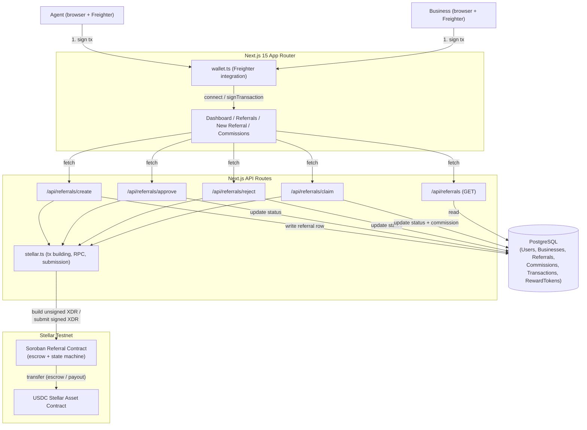

# Architecture

## System diagram

## Why a backend sits between the wallet and the contract

Freighter signs transactions, but it doesn't build them. The backend's
`stellar.ts` is responsible for constructing a correctly-formed, simulated,
fee-and-footprint-assembled Soroban transaction (via `prepareTransaction`)
and handing back raw XDR — Freighter's job is narrowly "does the person
approve this exact transaction," not "figure out what transaction this
should be." This also means the app's secret keys never exist: every
state-changing action is signed by whichever wallet (agent's or business's)
is actually authorizing it, and the backend never holds funds or keys for
either party.

## Why Postgres exists alongside a contract that already stores referrals

The contract is the source of truth for anything involving money: whether
a referral exists, whether it's approved, whether it's been paid out. But
it deliberately doesn't store the things a contract shouldn't have to —
client names, business display names, a denormalized list for fast
dashboard queries, links to a transaction's place on a block explorer.
Postgres mirrors the contract's state machine (kept in sync by each API
route only ever writing to the DB *after* its corresponding on-chain
transaction has actually succeeded) and carries everything else.

## Stellar transaction flow, step by step

**Creating a referral**
1. Agent fills out the referral form and clicks Submit. The frontend already
   knows the agent's address from the connected wallet.
2. Frontend calls `POST /api/referrals/create` with `step: "build"`. The
   backend loads the agent's account from Soroban RPC, builds a transaction
   invoking the contract's `create_referral(agent, business, commission)`,
   simulates and prepares it, and returns the XDR.
3. Frontend hands that XDR to Freighter via `signTransaction`. The agent
   reviews and approves it in the extension popup; Freighter returns a
   signed XDR.
4. Frontend calls `POST /api/referrals/create` again with `step: "submit"`
   and the signed XDR. The backend submits it to Soroban RPC, polls until
   the transaction lands, reads the on-chain referral id from the contract's
   return value, and only then creates the `Referral` row in Postgres
   (status `PENDING`) along with a `Transaction` row recording the hash.

**Approving (escrow)**
1. Business sees the pending referral and clicks Approve.
2. `POST /api/referrals/approve` (`step: "build"`) builds a transaction
   invoking `approve_referral(business, referral_id)`.
3. Business signs it in Freighter. Inside the contract, this single
   signature authorizes both the contract's own business-identity check
   *and* the nested token transfer that moves the commission from the
   business's balance into the contract's own balance — Soroban's auth
   model lets one signed top-level invocation cover everything it triggers,
   so no second signature is needed for the nested transfer.
4. `step: "submit"` submits the signed XDR; on success the backend flips the
   Postgres row to `APPROVED`.

**Rejecting** follows the same two-step build/sign/submit shape calling
`reject_referral`, with no token movement — the database row moves straight
to `REJECTED`.

**Claiming**
1. Once approved, the agent clicks Claim.
2. `POST /api/referrals/claim` (`step: "build"`) builds a transaction
   invoking `claim_commission(agent, referral_id)`.
3. The agent signs it. The contract releases the escrowed balance it's
   holding to the agent — Soroban contracts automatically satisfy
   `require_auth()` for their *own* address when they invoke themselves, so
   the agent's signature alone is enough to authorize the contract paying
   out its own escrow.
4. `step: "submit"` submits it; on success the backend marks the referral
   `CLAIMED` and creates the `Commission` row used by the Commission
   History page.

Every step above writes a `Transaction` row with the real testnet hash, so
every status change in the UI links straight to that transaction on
Stellar Expert.
